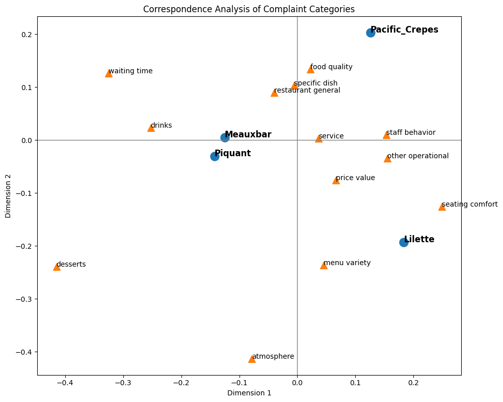

## About the Project

This repository contains the notebooks used in my research on cross-restaurant customer feedback analysis.

The project consists of three main stages:

- **00_Aspect_Categorization.ipynb** – uses an LLM to group more than 200 unique aspect terms extracted by a Hybrid ABSA pipeline into 16 standardized business categories.
- **01_Exploratory_Data_Analysis.ipynb** – performs exploratory data analysis, including sentiment distributions, category frequencies, and basic descriptive statistics.
- **02_Cross-restaurant-statistical-analysis-of-complaint.ipynb** – compares restaurants using statistical methods to determine whether customer complaint patterns differ significantly across businesses.

---

## Quick Results

### Restaurant similarity

The figure below projects restaurants into a two-dimensional space based on their complaint profiles. Restaurants positioned closer together exhibit more similar distributions of customer complaints.

---

### Complaint distribution by category

The next visualization compares the proportion of complaint categories across all four restaurants.

Although each restaurant has its own characteristics, the overall complaint distributions are remarkably similar, suggesting that many operational issues are shared across businesses.

*(Figure 2)*

---

### Sentiment distribution by category

The final visualization shows the proportion of positive, neutral, and negative mentions for every aspect category across all four restaurants.

This makes it possible to identify which categories are consistently appreciated and which represent common sources of dissatisfaction.

*(Figure 3)*

